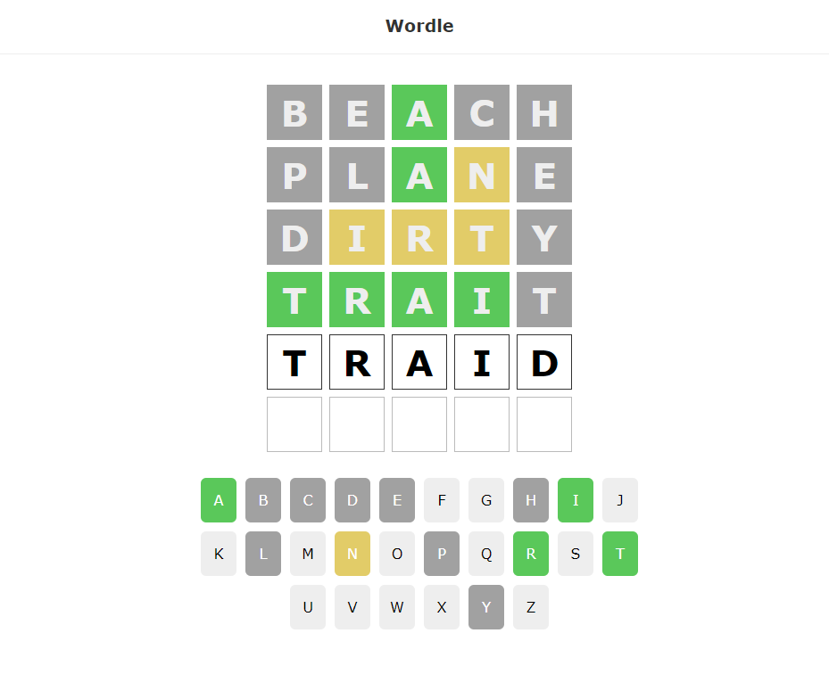

<div id="top"></div>

<!-- PROJECT LOGO -->
<br />
<div align="center">
  <a href="https://github.com/JordHemsworth/GameAPI">
    
  </a>

<h3 align="center">Game API</h3>

  <p align="center">
    A fun project to develop my React skills, based on the popular word game - [Wordle](https://www.nytimes.com/games/wordle/index.html)
  </p>
</div>


<!-- TABLE OF CONTENTS -->
<details>
  <summary>Table of Contents</summary>
  <ol>
    <li>
      <a href="#about-the-project">About The Project</a>
      <ul>
        <li><a href="#built-with">Built With</a></li>
      </ul>
    </li>
    <li>
      <a href="#getting-started">Getting Started</a>
      <ul>
        <li><a href="#installation">Installation</a></li>
      </ul>
    </li>
    <li><a href="#contact">Contact</a></li>
  </ol>
</details>


<!-- ABOUT THE PROJECT -->
## About The Project

<div align="center">
  <a href="http://35.173.49.241/">
    
  </a>
    <p> Click to view site! </p>
</div>

<p align="right">(<a href="#top">back to top</a>)</p>


### Built With

* [React](https://reactjs.org/)
* This project was bootstrapped with [Create React App](https://github.com/facebook/create-react-app).
* [Wordle](https://www.nytimes.com/games/wordle/index.html)

<p align="right">(<a href="#top">back to top</a>)</p>


<!-- GETTING STARTED -->
## Getting Started

To use this project locally, simply follow the example steps below.

### Installation

To install the site locally, follow the steps below.

1. Clone GitHub repo for this project locally [https://github.com/JordHemsworth/ReactWordle](https://github.com/JordHemsworth/ReactWordle)

2. CD into the project
   ```sh
   cd React-Wordle
   ```
3. Install NPM packages
   ```sh
   npm install
   ```
4. Start server
   ```sh
   npm run start
   ```
5. Load JSON Server
   ```sh   
   json-server ./data/db.json --port 3001
   ```
6. Enjoy playing Wordle!

<p align="right">(<a href="#top">back to top</a>)</p>

### To Do
1. Work on a more responsive design for Mobile.

2. Implement modals for screenshots and trailer

3. Detailed other pages such as full games list with pagination. 

4. Work on Livewire simultaneous requests.

<!-- CONTACT -->
## Contact

* [LinkedIn](https://www.linkedin.com/in/jordanhemsworth/)

* [Github Project Link](https://github.com/JordHemsworth/ReactWordle)


<p align="right">(<a href="#top">back to top</a>)</p>